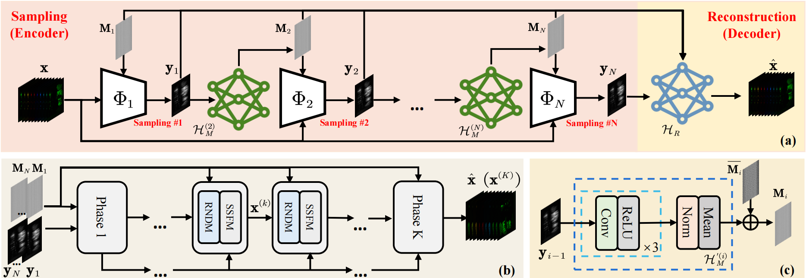

<div align="center">
<h2>Progressive Content-aware Coded Hyperspectral Compressive Imaging
</h2>

[](https://arxiv.org/abs/2303.09773) [](https://ieeexplore.ieee.org/abstract/document/10551290) 

[Xuanyu Zhang](https://xuanyuzhang21.github.io/), [Bin Chen](https://scholar.google.com/citations?user=aZDNm98AAAAJ&hl=zh-CN&oi=ao), Wenzhen Zou, Shuai Liu, Yongbing Zhang, Ruiqin Xiong and  [Jian Zhang](https://jianzhang.tech/)

*School of Electronic and Computer Engineering, Peking University*
</div>

Accepted for publication as a Regular paper in the IEEE Transactions on Circuits and Systems for Video Technology (TCSVT).

## Core Ideas



## Environment

```shell
pip install -r requirements.txt
```
## Train

Please download the CAVE dataset from [TSA-Net](https://github.com/mengziyi64/TSA-Net) and put it into the `./datasets` directory.

Two-shot Training
```
python train.py --template pca --outf ./exp/pca/ --method pca
```

Single-shot Training
```
python train_singleshot.py --template pca --method rnd --outf ./exp/rnd/
```

## Test

Two-shot sampling and reconstruction. The model checkpoint file is provided in `./checkpoints/model.pth`.
```
python test.py --template pca --outf ./exp/pca/ --method pca --pretrained_model_path ./checkpoints/model.pth
```

Single-shot reconstruction. The model checkpoint file is provided in `./checkpoints/model_singleshot.pth`.
```
python test_singleshot.py --template pca --outf ./exp/rndhrnet/ --method rnd --pretrained_model ./checkpoints/model_singleshot.pth
```
